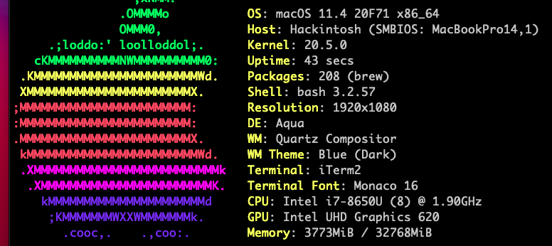

# Lenovo ThinkPad T480 hackintosh

# macOS Ventura

Working (compared to other setup I've found):

* FileVault2
* Physical mouse buttons with VoodooPS2
* Brightness Hotkey F5,F6
* Fixed LED blinking after WAKE/SLEEP
* ~FAN speed in HWMonitor~ (Fan speed is correctly reported within YogaSMCNC)
* No color banding, Display is correctly seen as 24-Bit Color (ARGB8888) : issue reported by @bugraduz 
* HDMI output enabled automatically at boot/wake : issue reported by @opatotto
* No sound distortion with headphones : issue reported by @bugraduz, fixed with ComboJack for alc257 https://github.com/hackintosh-stuff/ComboJack/commit/28e35e5f8613195aff627d78362ee3f4cd8397a3

Tested with:
* T480 i7-8650U FHD, 32GB RAM, NVME, nvidia MX150 deactivated in DSDT/SSDT
* macOS 13.3.1 (22E772610a)
* Wireless DW1560, NGFF Broadcom BCM4352 802.11ac with PCID [14e4:43b1]
* Wireless DW1820a : use config.DW1820a.plist
* Wireless BCM94360NG : use config.BCM94360NG.plist (reported by @opatotto #16)
* CPU i7-8650U : use https://github.com/stevezhengshiqi/one-key-cpufriend for correct power-state/energy saving

If you're using AirDrop (file sharing with another apple product), remove "io80211.awdl=0" from config.plist

Clover from https://github.com/CloverHackyColor/CloverBootloader

ComboJack https://github.com/hackintosh-stuff/ComboJack
- Handle events related to headphones/line-in

Optional - ThinkpadAssistant from https://github.com/MSzturc/ThinkpadAssistant
- F4 key : Mute/Unmute microphone, with LED
- F7:dual display, F8:Wi-Fi, F9:preferences, F10:bluetooth, F11:keyboard,F12:launchpad & Fn-Space:keyboard backlight
- Fn+ESC : switch function/media keys

Optional - YogaSMCPane from https://github.com/zhen-zen/YogaSMC
- Fan read / Fan control

SSD tricks:

* Disable hibernation (speeds up entering sleep mode)  
sudo pmset -a hibernatemode 0

* Set hibernatefile to `/dev/null` so it will not be recreated  
sudo pmset -a hibernatefile /dev/null

Untested:  
built-in intel wireless & bluetooth should work  
remove AirportBrcmFixup.kext, BrcmFirmwareData.kext and BrcmPatchRAM3.kext  
put itlwm.kext and IntelBluetoothFirmware.kext  
https://github.com/OpenIntelWireless/itlwm  
https://github.com/OpenIntelWireless/IntelBluetoothFirmware  

