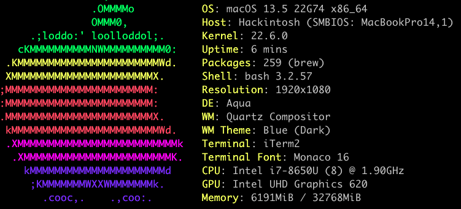

<h1>Lenovo ThinkPad T480 hackintosh</h1>

Working (compared to other setup I've found):

* FileVault2
* Physical mouse buttons with VoodooPS2
* Brightness Hotkey F5,F6
* Fixed LED blinking after WAKE/SLEEP
* FAN speed in HWMonitor
* No color banding, Display is correctly seen as 24-Bit Color (ARGB8888) : issue reported by @bugraduz 
* HDMI output enabled automatically at boot/wake : issue reported by @opatotto

Tested with:
* T480 i7-8650U FHD, 32GB RAM, NVME, nvidia MX150 deactivated in DSDT/SSDT
* macOS 11.0.1 (20B29)
* Wireless DW1560, NGFF Broadcom BCM4352 802.11ac with PCID [14e4:43b1]
* Wireless DW1820a : use config.DW1820a.plist
* CPU i7-8650U : use https://github.com/stevezhengshiqi/one-key-cpufriend for correct power-state/energy saving

Clover from https://github.com/CloverHackyColor/CloverBootloader

Optional - ThinkpadAssistant from https://github.com/MSzturc/ThinkpadAssistant
- F4 key : Mute/Unmute microphone, with LED
- F7:dual display, F8:Wi-Fi, F9:preferences, F10:bluetooth, F11:keyboard,F12:launchpad & Fn-Space:keyboard backlight
- Fn+ESC : switch function/media keys

SSD tricks:

* Disable hibernation (speeds up entering sleep mode)  
sudo pmset -a hibernatemode 0

* Set hibernatefile to `/dev/null` so it will not be recreated  
sudo pmset -a hibernatefile /dev/null

